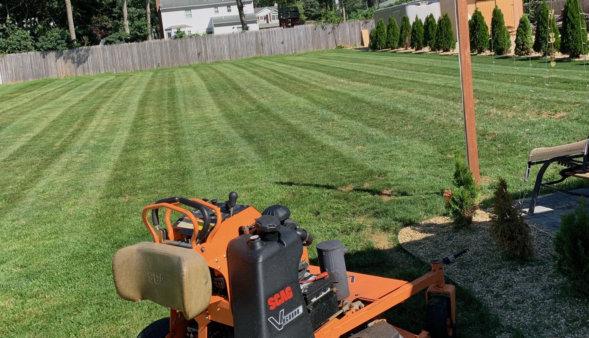
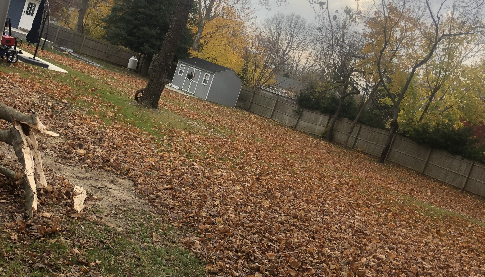
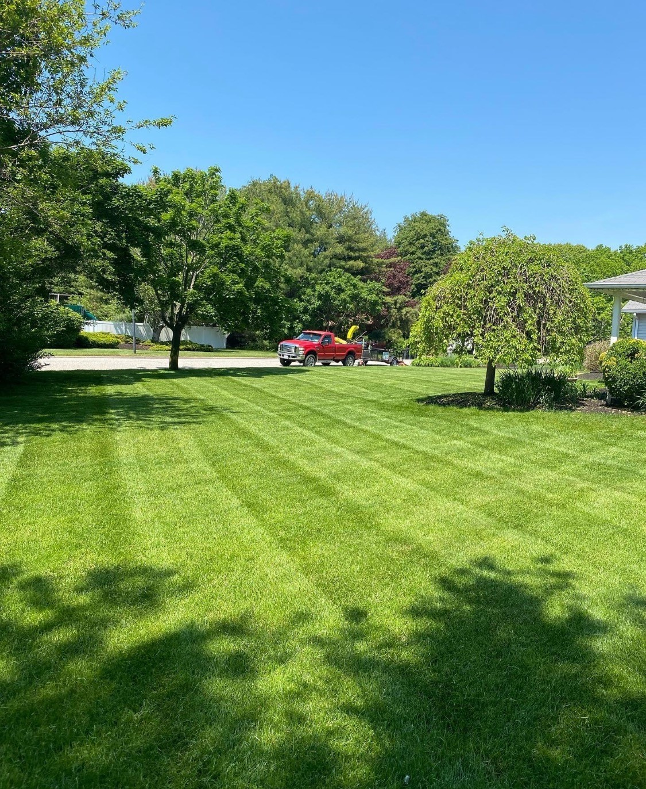
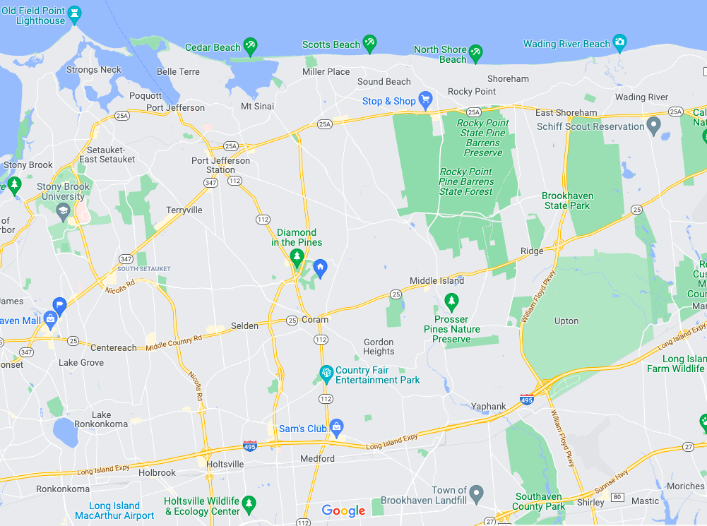

<!DOCTYPE html>
<html lang="en">

<head>
    <!-- basic -->
    <meta charset="utf-8">
    <meta http-equiv="X-UA-Compatible" content="IE=edge">
    <!-- mobile metas -->
    <meta name="viewport" content="width=device-width, initial-scale=1">
    <meta name="viewport" content="initial-scale=1, maximum-scale=1">
    <!-- site metas -->
    <title>Grattitude</title>
    <meta name="keywords" content="">
    <meta name="description" content="">
    <meta name="author" content="">
    <!-- bootstrap css -->
    <link rel="stylesheet" href="css/bootstrap.min.css">
    <!-- owl css -->
    <link rel="stylesheet" href="css/owl.carousel.min.css">
    <!-- style css -->
    <link rel="stylesheet" href="css/style.css">
    <!-- responsive-->
    <link rel="stylesheet" href="css/responsive.css">
    <!-- awesome fontfamily -->
    <link rel="stylesheet" href="https://cdnjs.cloudflare.com/ajax/libs/font-awesome/4.7.0/css/font-awesome.min.css">
    <!--[if lt IE 9]>
      
      <![endif]-->
</head>
<!-- body -->

<body class="main-layout">
    <!-- loader  -->
    

        

    

    

        <!-- end loader -->

        

            <!-- header -->
            <header>
                <!-- header inner -->
                

                    

                        

                            

                                

                                    <a href="#"> Email : gratitudelandscaping@gmail.com</a>
                                

                            

                            

                                

                                    <a href="images/index.html">Gratitude Landscaping</a>
                                

                            

                            

                                

                                    <a href="#">  Contact : +631-935-4928</a>
                                

                            

                        

                    

                

                

                    

                        <nav class="navigation navbar-expand-md  navbar-dark ">

                            <button class="navbar-toggler" type="button" data-toggle="collapse" data-target="#navbarsExample04" aria-controls="navbarsExample04" aria-expanded="false" aria-label="Toggle navigation">
                                
                            </button>

                            

                                <ul class="navbar-nav mr-auto">
                                    <li class="nav-item active">
                                        <a class="nav-link" href="index.html">Home (current)</a>
                                    </li>
                                    <li class="nav-item">
                                        <a class="nav-link" href="#about">About </a>
                                    </li>
                                    <li class="nav-item">
                                        <a class="nav-link" href="#services">Services</a>
                                    </li>
                                    <li class='nav-itme'>
                                        <a class='nav-link' href='#gallery'>Gallery</a>
                                    </li>
                                    <li class="nav-item">
                                        <a class="nav-link" href="#contact">Contact us</a>
                                    </li>

                                </ul>
                            

                        </nav>
                    

                

                <!-- end header inner -->
            </header>
            <!-- end header -->
            <!-- start slider section -->
            

                

                    <ol class="carousel-indicators">
                        <li data-target="#myCarousel" data-slide-to="0" class="active"></li>
                        <li data-target="#myCarousel" data-slide-to="1"></li>
                        <li data-target="#myCarousel" data-slide-to="2"></li>
                    </ol>
                    

                        

                            
                            

                                

                                      
                                    <h1>Highlight 
                <strong class="dark_brown">Your Home's Landscape</strong></h1>

                                    <a href="#contact">contact us</a>
                                

                            

                        

                        

                            
                            

                                

                                     
                                    <h1>Maintain 
                <strong class="dark_brown">Lawn & Hedgings</strong></h1>

                                    <a href="#contact">contact us</a>
                                

                            

                        

                        

                            
                            

                                

                                     
                                    <h1>Cleanup 
                <strong class="dark_brown">Fall & Spring</strong></h1>

                                    <a href="#contact">contact us</a>
                                

                            

                        

                    

                    <a class="carousel-control-prev" href="#myCarousel" role="button" data-slide="prev">
                        
                        Previous
                    </a>
                    <a class="carousel-control-next" href="#myCarousel" role="button" data-slide="next">
                        
                        Next
                    </a>
                

            

            <!-- end slider section -->

            <!-- About us-->
            

                

                    

                        

                            

                                

                                    

                                        <h2>About <strong class="black"> us</strong></h2>
                                    

                                    
A local Long Island landscaping company working hard to provide our clients with consistency and reliability for their homes.  Serving towns across Suffolk County.

                                

                            

                        

                        

                            

                                <figure></figure>

                            

                        

                    

                

            

            <!-- end about us-->

            <!-- Services -->
            

                

                    

                        

                            

                                <h2><strong class="black">Services</strong></h2>
                            

                        

                    

                    

                        

                            

                                <figure></figure>
                                <h3>• Lawn Maintenance</h3>
                            

                        

                        

                            

                                <figure></figure>
                                <h3>• Fall/Spring Cleanup</h3>

                            

                        

                        

                            

                                <figure></figure>
                                <h3>• Topsoil/Mulch</h3>
                            

                        

                        

                            

                                <figure></figure>
                                <h3>• Aeration</h3>
                            

                        

                        

                            

                                <figure></figure>
                                <h3>• Tree Trimming/Prunning</h3>
                        

                    

                

            

            <!-- end Services -->
            
            <!-- our pricing -->
            
            <!-- end our pricin;/g -->

            

            

            <!-- footer -->
            

                

                    

                        

                            

                                <h2>Contact<strong class="black"> Us</strong></h2>
                            

                        

                    

                

            

            

                

                    

                        <form id="main_form" class="main_form" method="POST" action="https://script.google.com/macros/s/AKfycbxFi_6K0kYEuipKrWd5ZO6i8s_wyecynsyYlCk5w3JvOZDwiaxuiKpCCS7w8Tm3QM-QPg/exec">
                            

                                

                                    <input class="form-control" placeholder="Name" type="text" name="Name" required>
                                

                                

                                    <input class="form-control" placeholder="Email" type="text" name="Email" required>
                                

                                

                                    <input class="form-control" placeholder="Phone" type="text" name="Phone" required>
                                

                                

                                    <textarea class="textarea" placeholder="Message" type="text" name="Message" required></textarea>
                                

                                

                                    <button class="send">Send</button>
                                

                                

                                    <ul class="mail-icon">
                                        <li class="phone_num"href="tel:631935-4928"> 631-935-4928</li>
                                        <li> gratitudelandscaping@gmail.com</li>

                                    </ul>
                                

                                

                                    <ul class="social_icon">
                                        <li> <a href="#"><i class="fa fa-facebook-f"></i></a></li>
                                        <li> <a href="#"><i class="fa fa-twitter"></i></a></li>
                                        <li> <a href="https://www.instagram.com/gratitudelandscape/"><i class="fa fa-instagram"></i></a></li>
                                    </ul>
                                

                            

                        </form>
                    

                    

                        

                            

                                 
                                <!--  THIS WILL BE FILLED WHEN WE DECIDE TO PURCHASE THE GOOGLE API.  MAP DEEMED UNNECESSARY ATM -->
                            

                        

                    

                

            

        

    

    <footer>
        

            

                

                    

                        

                            
© All rights reserved to Gratitude Landscaping, LLC 2021

                            
                        

                    

                

            

        

    </footer>
    <!-- end footer -->
    

    

    

    <!-- Javascript files-->
    
    
    
    
    
    

    
    

   

        
   
    <!-- google map js -->
    
    
    <!-- end google map js -->

</body>

</html>
